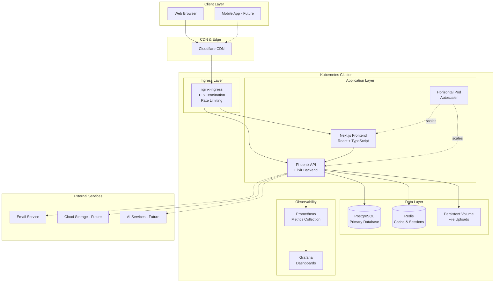
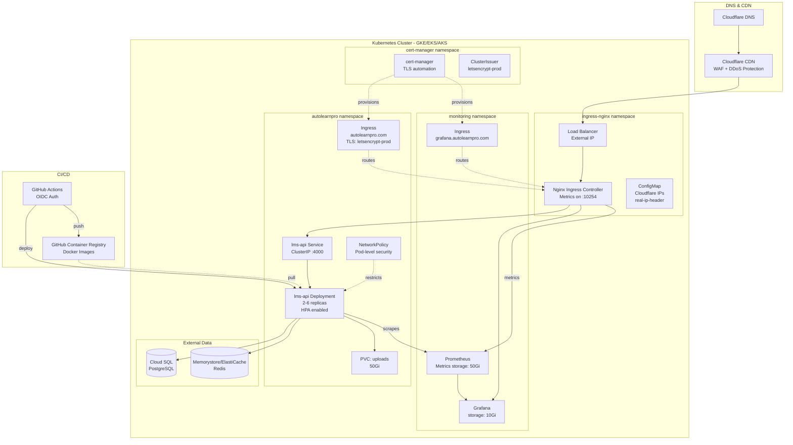
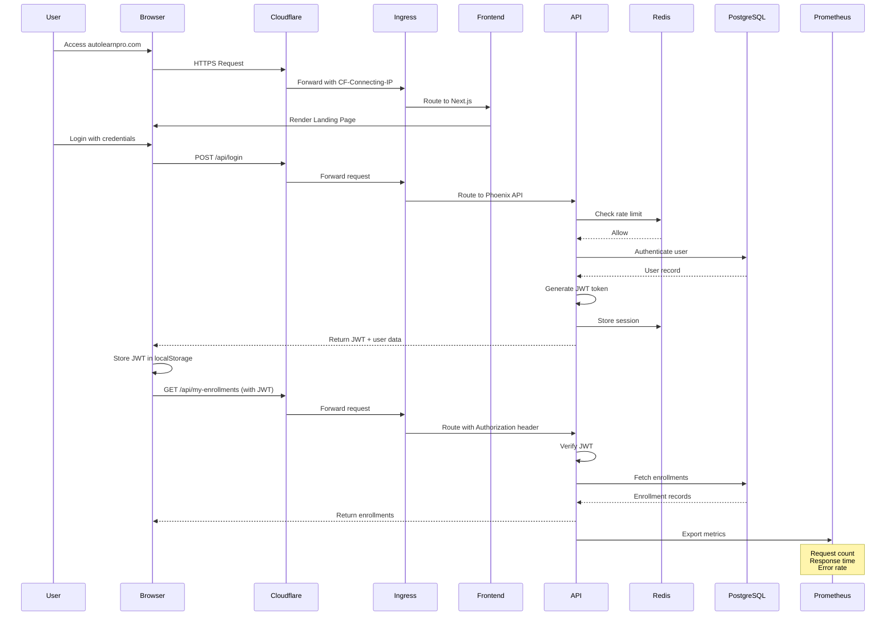
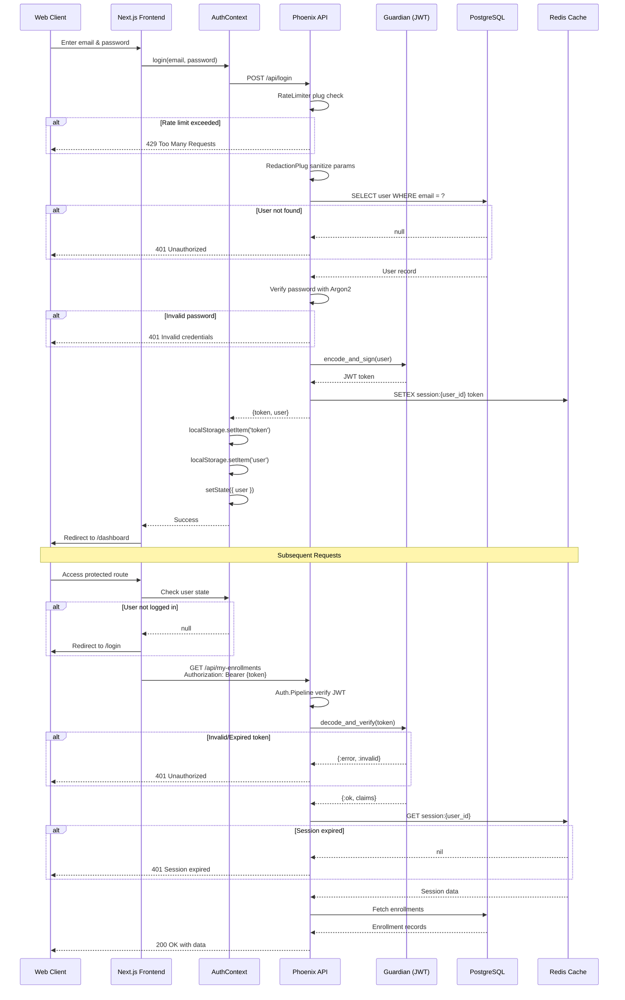
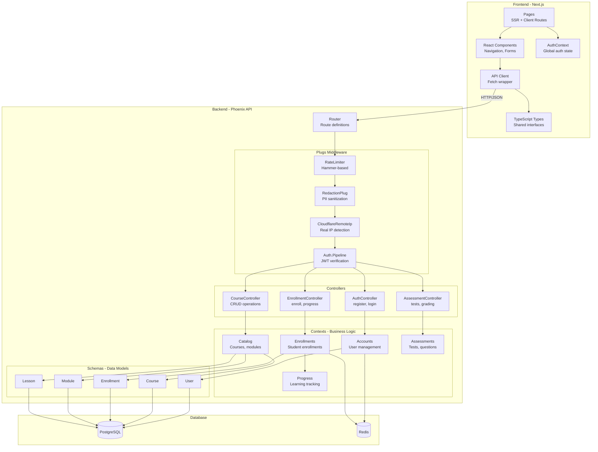
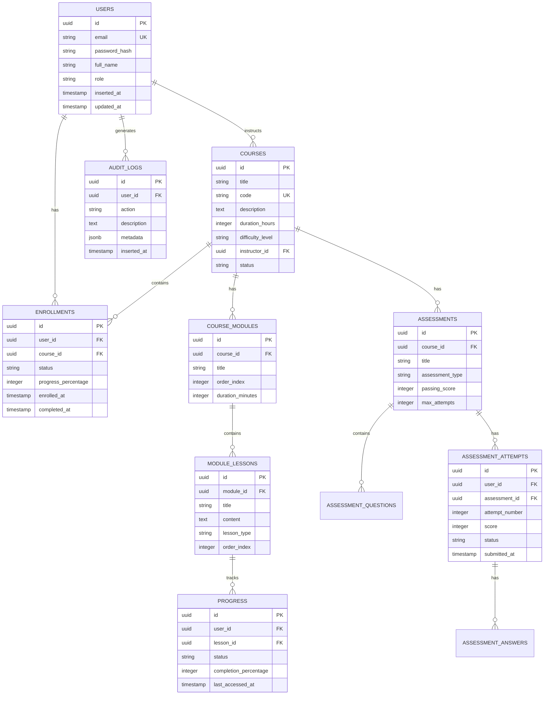
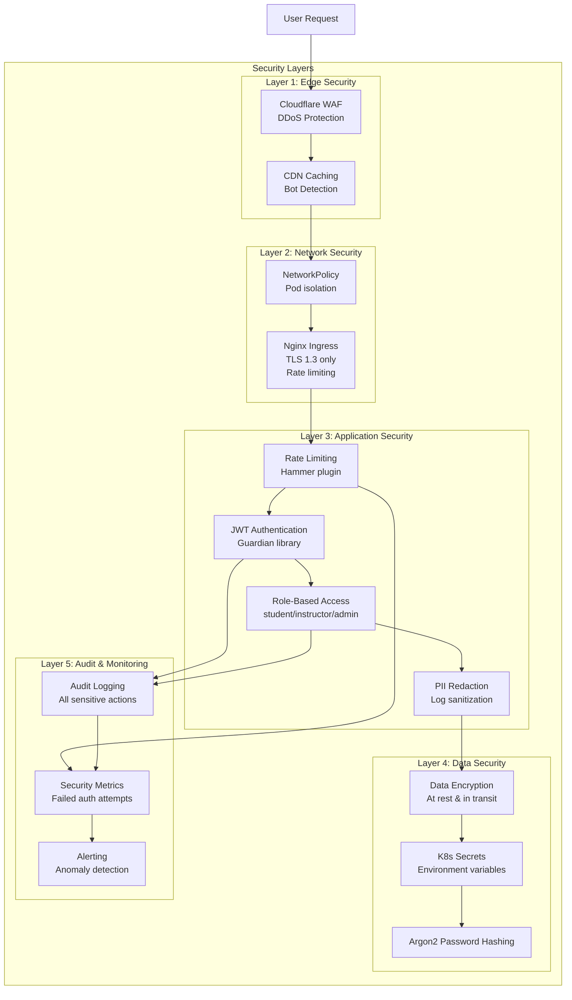
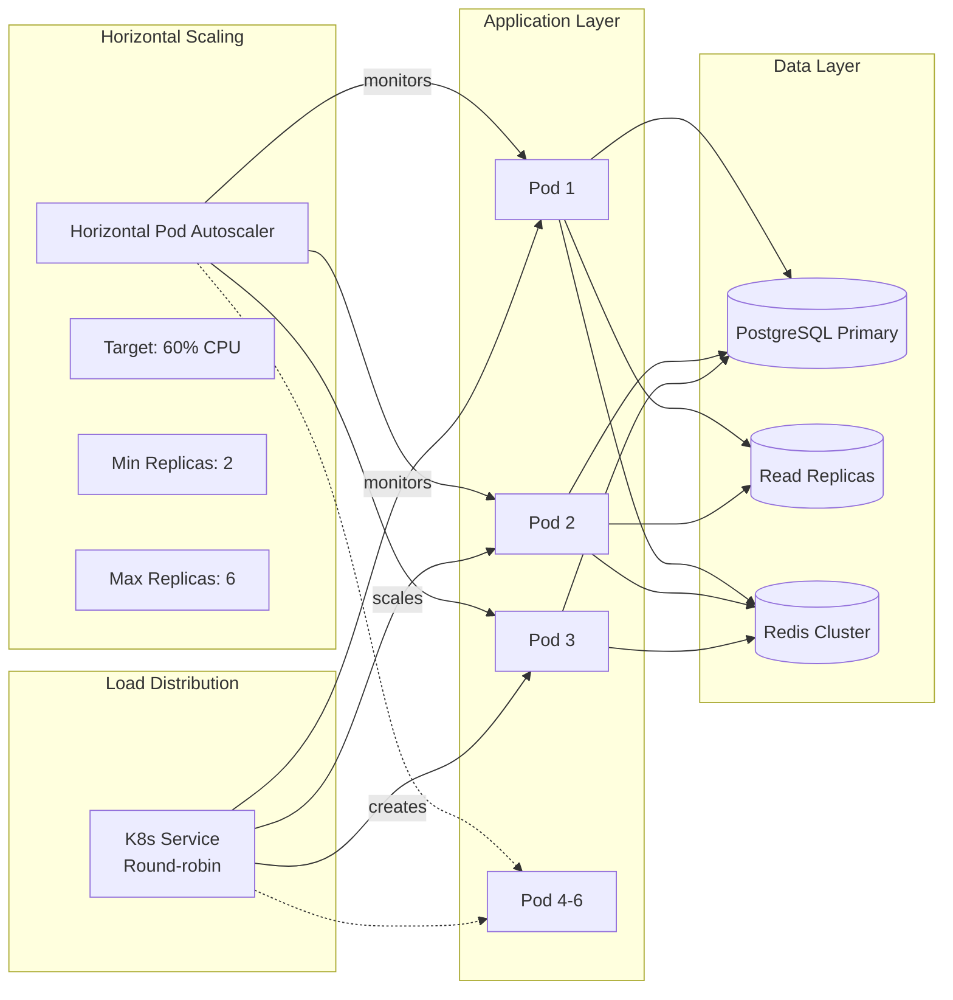

# AutoLearnPro LMS - System Architecture Documentation

## Table of Contents
- [Overview](#overview)
- [High-Level Architecture](#high-level-architecture)
- [Infrastructure Diagram](#infrastructure-diagram)
- [Data Flow Diagram](#data-flow-diagram)
- [Authentication Flow](#authentication-flow)
- [Deployment Pipeline](#deployment-pipeline)
- [Component Architecture](#component-architecture)
- [Database Schema](#database-schema)

---

## Overview

AutoLearnPro is a cloud-native Learning Management System built with:
- **Backend**: Elixir/Phoenix (REST API)
- **Frontend**: Next.js 14 (React, TypeScript)
- **Database**: PostgreSQL
- **Cache**: Redis
- **Infrastructure**: Kubernetes (multi-cloud ready)
- **Observability**: Prometheus + Grafana

**Deployment Model**: Containerized microservices on Kubernetes with horizontal auto-scaling

---

## High-Level Architecture

---

## Infrastructure Diagram

---

## Data Flow Diagram

---

## Authentication Flow

---

## Deployment Pipeline

```mermaid
graph LR
    subgraph "Developer Workflow"
        Dev[Developer]
        Git[Git Commit]
    end

    subgraph "GitHub Actions CI/CD"
        Trigger[Workflow Trigger<br/>push to main]
        
        subgraph "Build Stage"
            Checkout[Checkout Code]
            ElixirTests[Run Elixir Tests<br/>ExUnit + Coverage]
            Security[Security Scans<br/>Trivy + CodeQL]
            Build[Docker Build<br/>Multi-arch amd64/arm64]
        end

        subgraph "Push Stage"
            Tag[Tag Image<br/>SHA + latest]
            Push[Push to GHCR<br/>ghcr.io/73junito/lms-api]
        end

        subgraph "Deploy Stage"
            OIDC[OIDC Authentication<br/>GKE/EKS/AKS]
            UpdateManifest[Update Deployment<br/>Set image tag]
            Apply[kubectl apply]
            RolloutCheck[Verify Rollout Status]
            SmokeTest[Run Smoke Test Job]
        end
    end

    subgraph "Kubernetes Cluster"
        Deployment[lms-api Deployment]
        ReplicaSet[ReplicaSet]
        Pods[Pods 1-6]
        HealthCheck[Liveness/Readiness Probes]
    end

    subgraph "Automation"
        Dependabot[Dependabot<br/>Weekly dependency updates]
        CloudflareSync[Cloudflare IP Sync<br/>Weekly cron job]
    end

    Dev --> Git
    Git --> Trigger
    Trigger --> Checkout
    Checkout --> ElixirTests
    ElixirTests --> Security
    Security --> Build
    Build --> Tag
    Tag --> Push
    
    Push --> OIDC
    OIDC --> UpdateManifest
    UpdateManifest --> Apply
    Apply --> Deployment
    
    Deployment --> ReplicaSet
    ReplicaSet --> Pods
    Pods --> HealthCheck
    
    HealthCheck -->|healthy| RolloutCheck
    RolloutCheck --> SmokeTest
    
    HealthCheck -->|unhealthy| RolloutCheck
    RolloutCheck -.->|rollback| ReplicaSet
    
    Dependabot -.->|creates PR| Git
    CloudflareSync -.->|updates ConfigMap| Deployment
```

---

## Component Architecture

---

## Database Schema

---

## Security Architecture

---

## Scaling Strategy

---

## Technology Stack Summary

| Layer | Technology | Purpose |
|-------|-----------|---------|
| **Frontend** | Next.js 14, React, TypeScript, TailwindCSS | UI/UX, SSR, Client routing |
| **Backend** | Elixir 1.16, Phoenix, Ecto | REST API, Business logic |
| **Authentication** | Guardian, JWT, Argon2 | User auth, Token management |
| **Database** | PostgreSQL 15+ | Primary data store |
| **Cache** | Redis 7+ | Sessions, Rate limiting |
| **Container** | Docker, Multi-stage builds | Application packaging |
| **Orchestration** | Kubernetes 1.24+ | Container management |
| **Ingress** | nginx-ingress, cert-manager | Traffic routing, TLS |
| **Monitoring** | Prometheus, Grafana | Metrics, Dashboards |
| **Testing** | ExUnit, Playwright | Unit tests, E2E tests |
| **CI/CD** | GitHub Actions, OIDC | Automated deployment |
| **Security** | Cloudflare, NetworkPolicy, RBAC | Multi-layer security |

---

## Performance Characteristics

### Expected Response Times
- **Static pages**: < 200ms (TTL)
- **API authentication**: < 100ms (with Redis cache)
- **Course listing**: < 300ms (with eager loading)
- **Enrollment operations**: < 500ms (database writes)

### Scalability Targets
- **Concurrent users**: 10,000+
- **Requests/second**: 1,000+
- **Database connections**: 100 (pool size: 10 per pod × 10 pods)
- **Storage**: 1TB+ (uploads PVC scalable)

### High Availability
- **Uptime target**: 99.9% (43.8 min downtime/month)
- **RTO (Recovery Time Objective)**: < 5 minutes
- **RPO (Recovery Point Objective)**: < 1 hour
- **Pod disruption budget**: minAvailable: 1

---

## Future Enhancements

1. **Microservices Split**: Separate content generation service
2. **GraphQL API**: Add GraphQL endpoint alongside REST
3. **WebSocket Support**: Real-time updates for live sessions
4. **Mobile Apps**: Native iOS/Android applications
5. **AI Integration**: Content generation, auto-grading
6. **Video Streaming**: Integrated video player with CDN
7. **Internationalization**: Multi-language support
8. **Analytics Dashboard**: Advanced learning analytics

---

## References

- [Kubernetes Documentation](https://kubernetes.io/docs/)
- [Phoenix Framework](https://www.phoenixframework.org/)
- [Next.js Documentation](https://nextjs.org/docs)
- [Prometheus Best Practices](https://prometheus.io/docs/practices/)
- [Elixir Getting Started](https://elixir-lang.org/getting-started/introduction.html)

---

*Last Updated: December 16, 2025*  
*Version: 1.0*  
*Maintainer: AutoLearnPro Development Team*
